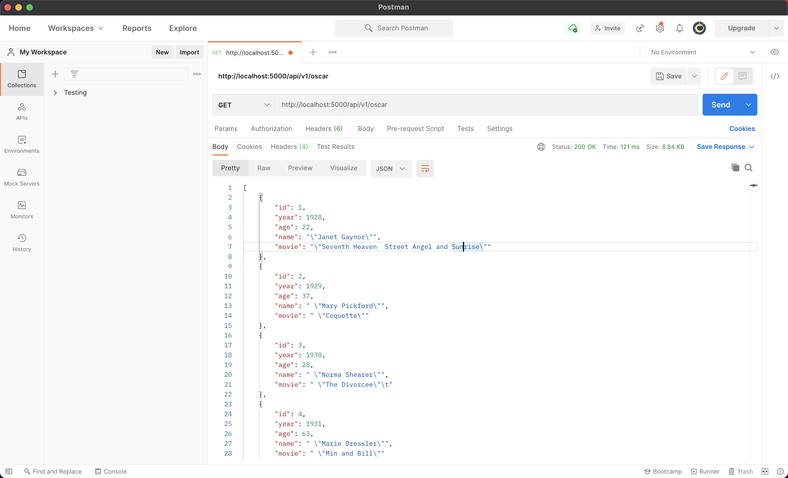
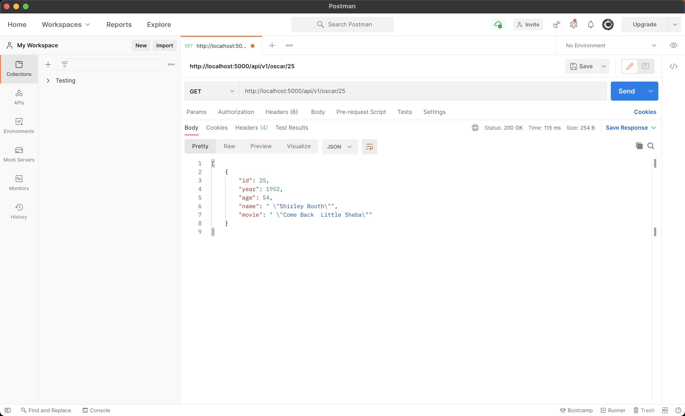
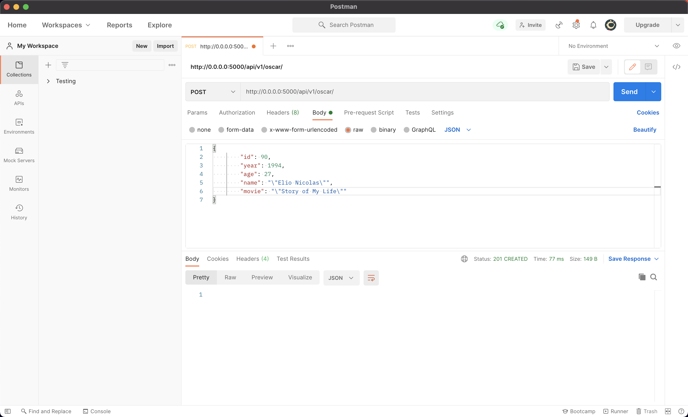
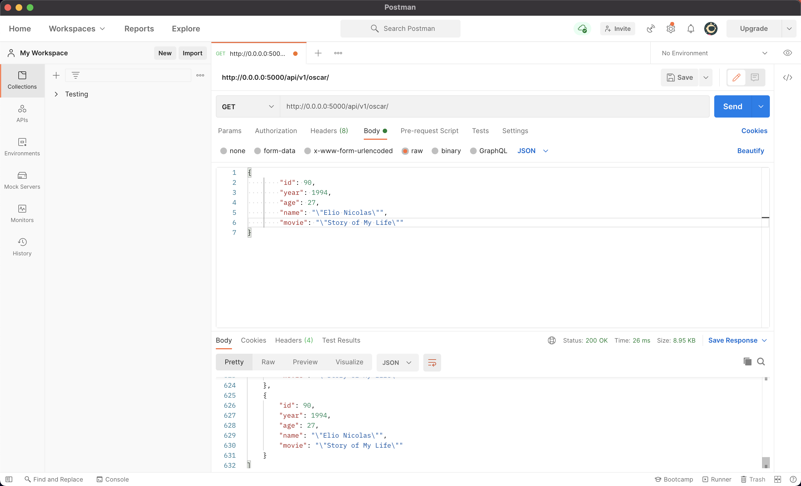
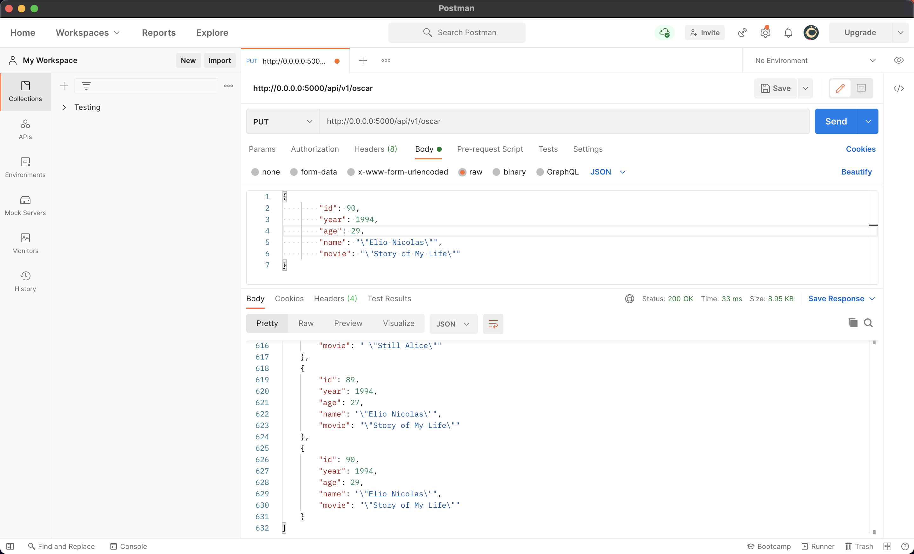
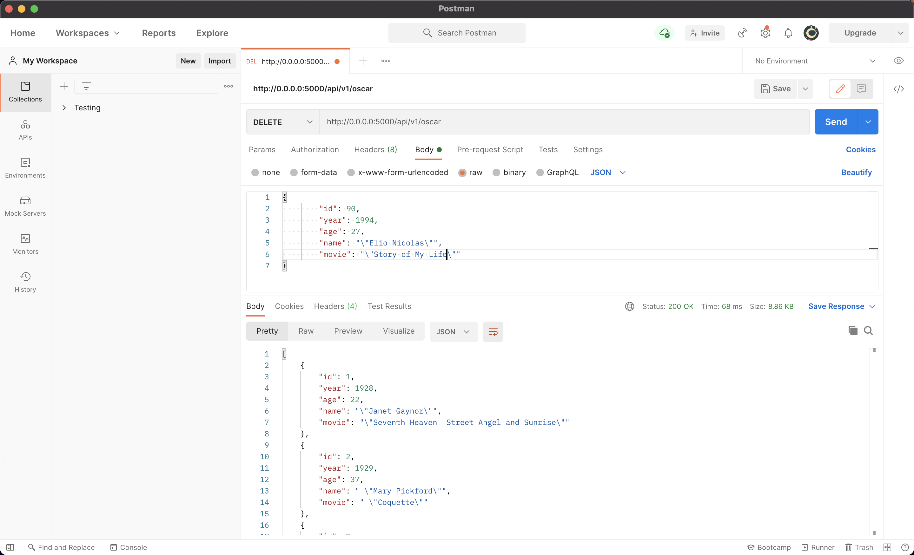
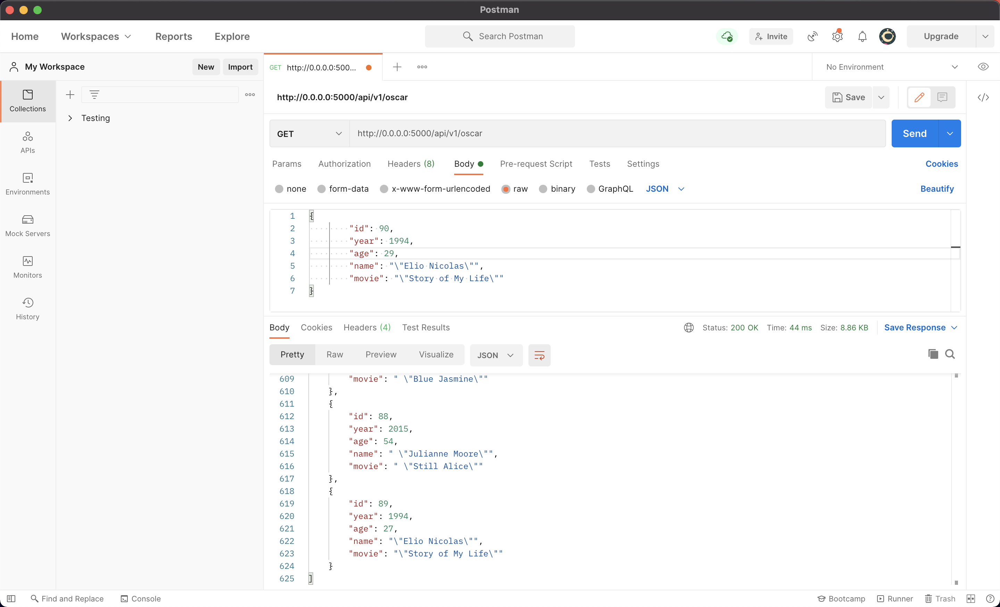

# Web App Homework #3
* By: Elio Nicolas
# Screenshots
 ## Data Table in Pycharm
 
 ## Homepage
 
 ## View Record
 
 ## New Record
 
 ### Update Existing Record
 
 ## Delete
 

# POSTMAN Screenshots
## Postman Listing All Records

## Postman Showing One Record with GET

## POSTMAN Creating Record with POST

### POSTMAN POST Success

## POSTMAN Editing a Record with PUT
 
## POSTMAN Deleting a Record with DELETE
 
### POSTMAN DELETE Success

